# 🚗 Car Rental App – Android Studio Project

> A full-featured car rental mobile application developed as part of an Android Development course.

---

## 📋 Overview

This project simulates a complete car rental system with both customer and admin functionalities.
It was developed as a team project to build a real-world mobile application experience.

---

## 👨‍💻 My Contribution (Backend Developer)

* Developed backend logic for **customer-side features**
* Implemented booking system and data handling
* Managed user data and system flow
* Built functionality for the **Find Us page**
* Integrated backend logic with frontend interfaces

---

## 📸 App Screenshots

### 📱 Splash Screen

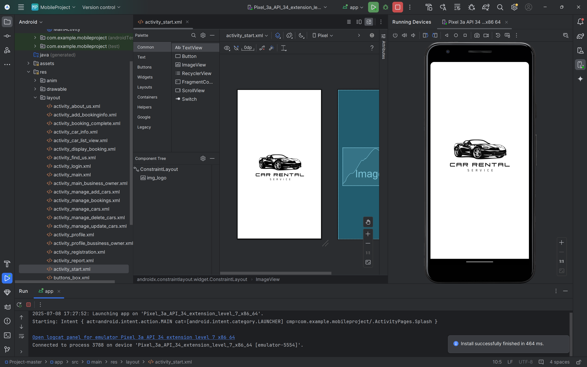

---

### 🔐 Authentication

| Login                           | Login 2                           | Register                              |
| ------------------------------- | --------------------------------- | ------------------------------------- |
| 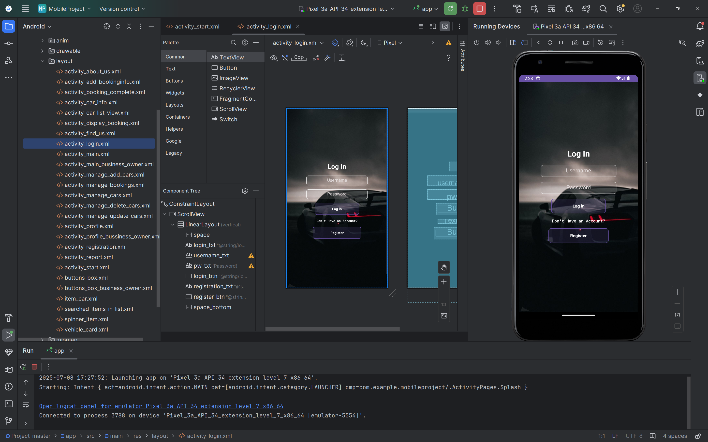 | 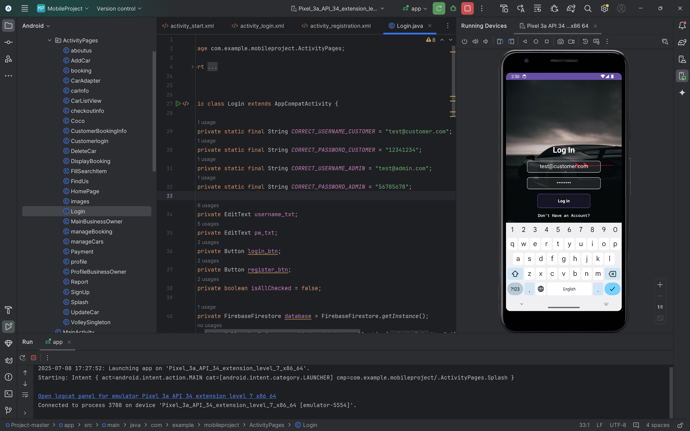 | 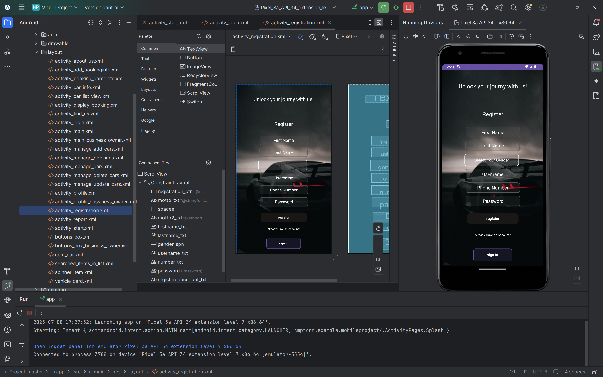 |

---

### 🏠 Customer Interface

| Main Page                      | Car List                         |
| ------------------------------ | -------------------------------- |
| 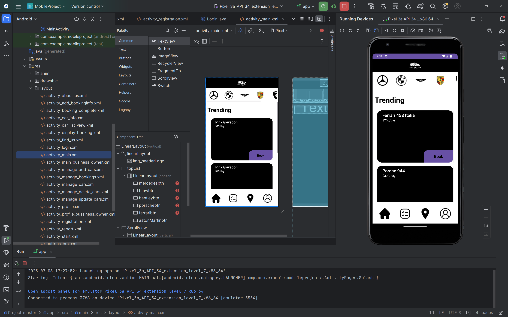 | 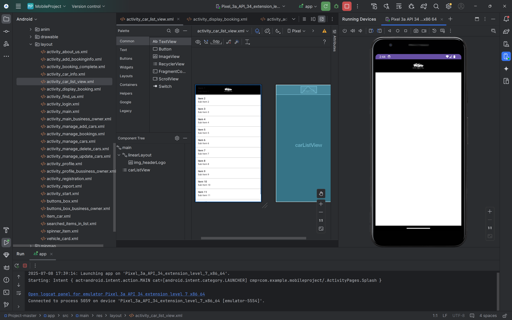 |

| Car Info                         | Booking                             |
| -------------------------------- | ----------------------------------- |
| 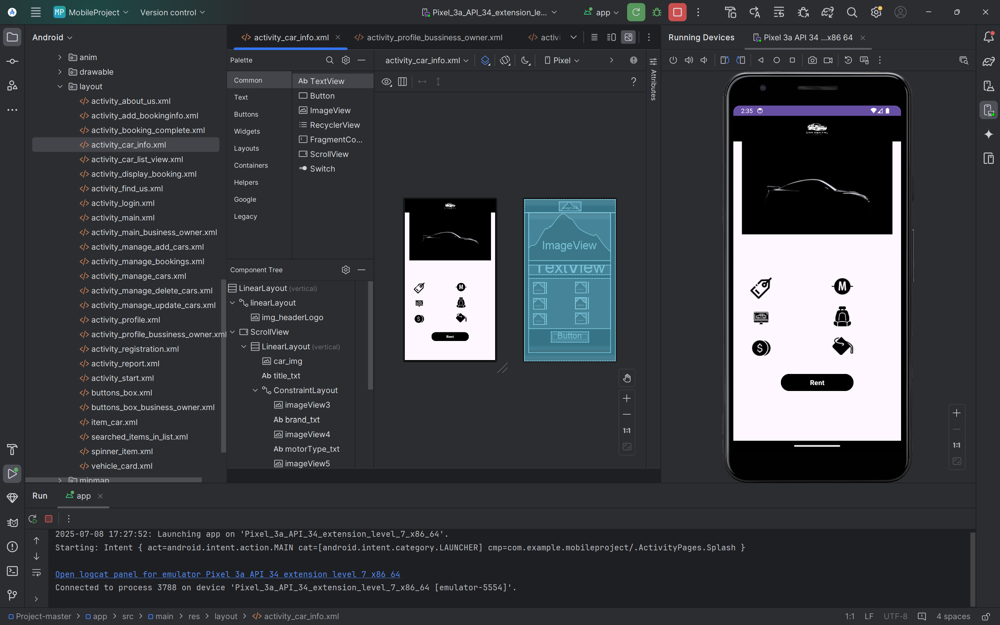 | 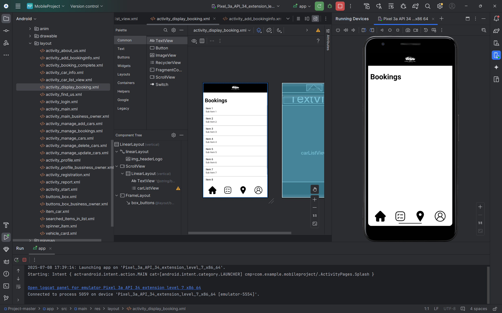 |

| Profile                             | Find Us                           | About Us                          |
| ----------------------------------- | --------------------------------- | --------------------------------- |
| 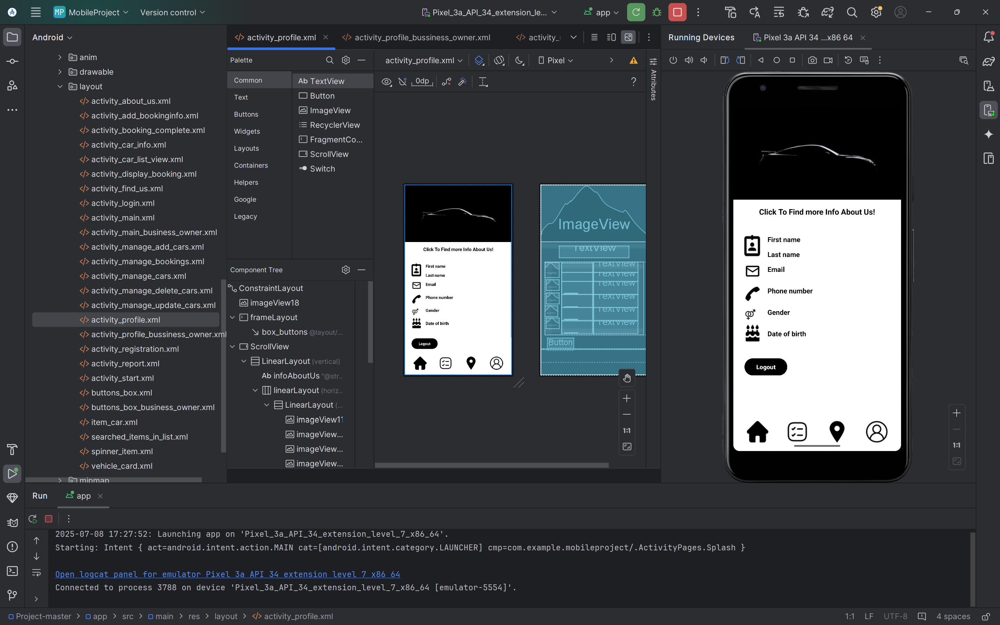 | 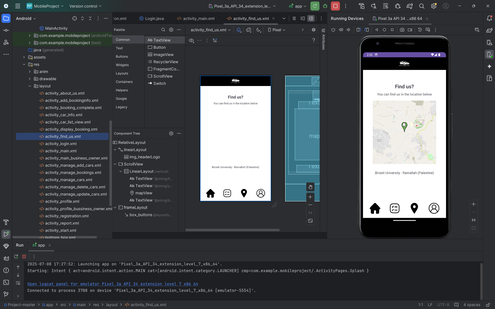 | 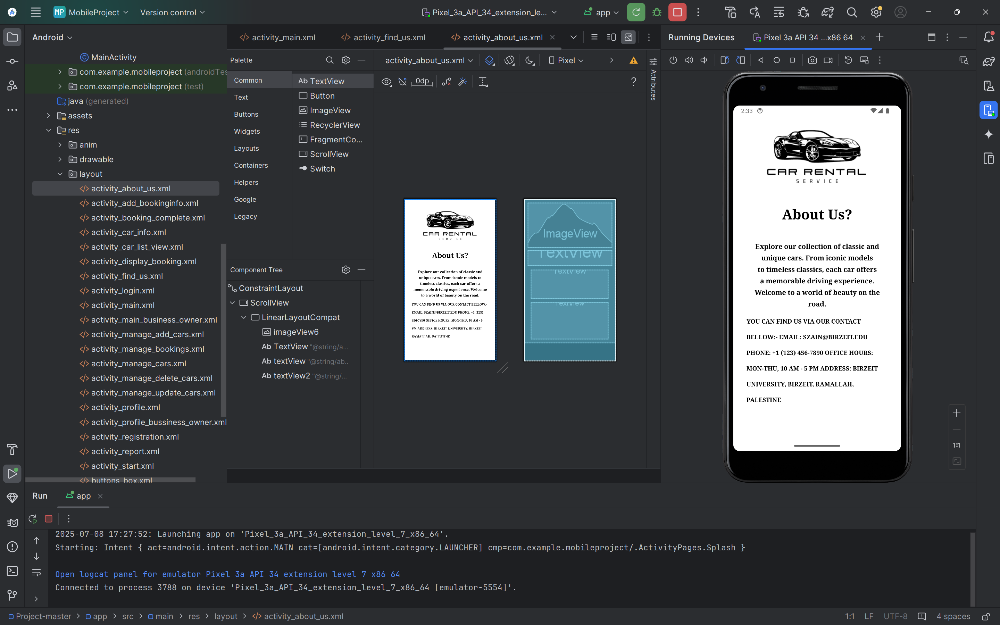 |

---

### 🚘 Renting Flow

| Step 1                          | Step 2                          | Step 3                          |
| ------------------------------- | ------------------------------- | ------------------------------- |
| 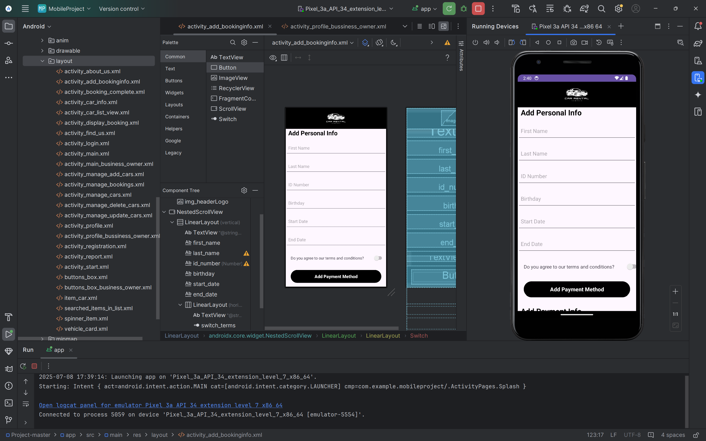 | 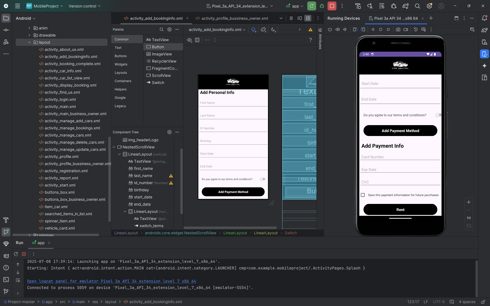 | 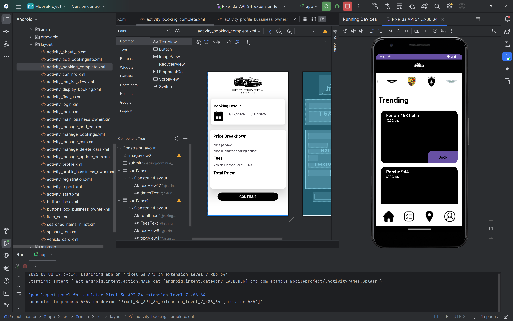 |

---

### ⚙️ Admin Interface

| Reports                                 |
| --------------------------------------- |
| 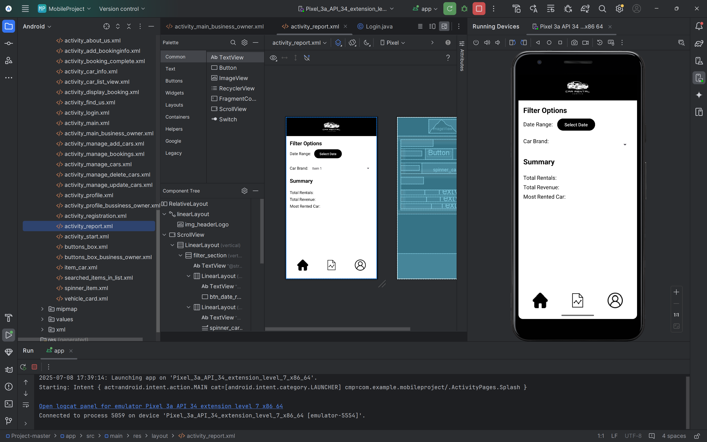 |

---

## 🚀 Features

* User authentication (login & registration)
* Car browsing and filtering
* Booking and rental system
* Admin dashboard for management
* Reports and analytics
* Location-based feature (Find Us)

---

## 🛠️ Technologies Used

* Android Studio
* Java / Kotlin
* XML (UI Layouts)
* Firebase / SQLite (adjust if needed)

---

## 🤝 Team Members

* Rama Shaheen – Backend Development (Customer)
* Hind Sumary – Front-end Development
* Ayah Jumah – Backend Development (Admin)

---

## 📚 Project Context

Developed as part of an **Android Development course**.
Completed within **two weeks**, requiring fast development and teamwork.

---

## ⭐ Highlights

* Full mobile app workflow
* Backend system integration
* Real-world application simulation
* Strong teamwork and collaboration

---

## 💬 Final Thoughts

This project strengthened my backend development skills and gave me hands-on experience in building real application logic.

It was a challenging and rewarding experience that helped me grow as a developer.
